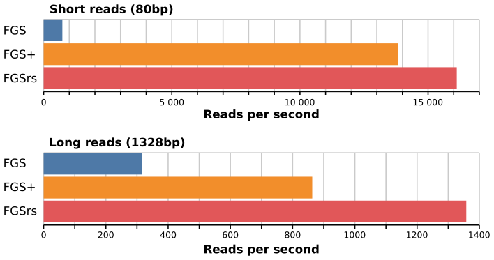
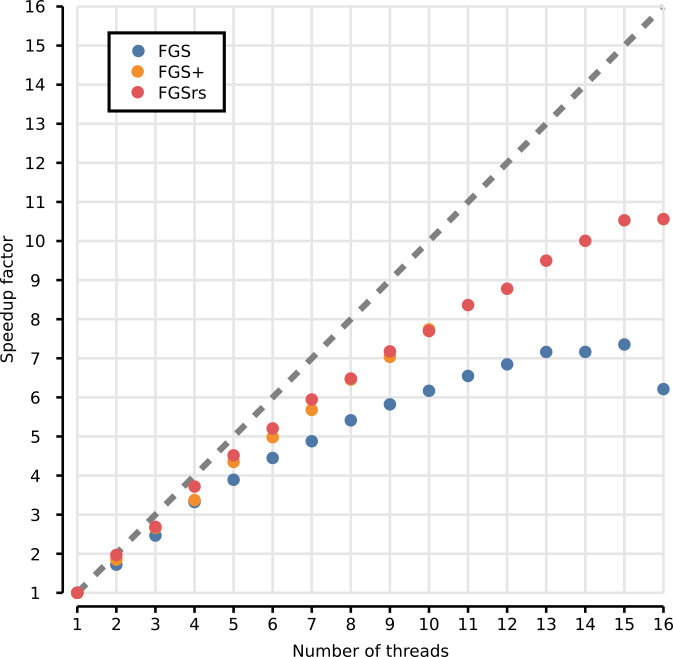
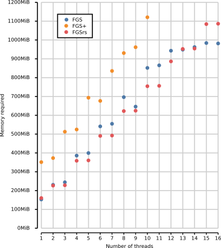

# FragGeneScanRs

## Installation

### From release

Download the build of the [latest release][release] for your platform
and extract it somewhere in your path.

[release]: https://github.com/unipept/FragGeneScanRs/releases/latest

### From source

FragGeneScanRs is written in Rust, so first head over to their
[installation instructions][Rust]. After, clone this repository or
download the source code of the [latest release][release]. In this
directory, run `cargo install --path .` to install. The installation
progress may prompt you to add a directory to your path so you can
easily execute it.

[Rust]: https://www.rust-lang.org/tools/install

## Usage

You can use FragGeneScanRs with the short options of FragGeneScan but
it also provides some additional options and long-form options. It
reads from and writes to standard input and standard output by default,
allowing shorter calls in case you only need the predicted proteins.

```sh
# get predictions for 454 pyrosequencing reads with about 1% error rate
FragGeneScanRs -t 454_10 < example/NC_000913-454.fna > example/NC_000913-454.faa

# get predictions for complete reads
FragGeneScanRs -t complete -w 1 < example/NC_000913.fna > example/NC_000913.faa
```

### Backwards compatible mode

```sh
FragGeneScanRs -s seq_file_name -o output_file_name -w [0 or 1] -t train_file_name -p num_threads
```

where:

* `seq_file_name` is the (FASTA) sequence file name including the full
  path

* `output_file_name` is the base name for the 3 outputfiles, including
  the full path. A `.out`, `.faa` and `.ffn` file will be created
  containing the gene prediction metadata, the predicted proteins, and
  the corresponding DNA reads.

* `0 or 1` for short sequence reads or complete genomic sequences.

* `train_file_name` is used to select the training file for one of the following types:

  - `complete` for complete genomic sequences or short sequence reads without sequencing error
  - `sanger_5` for Sanger sequencing reads with about 0.5% error rate
  - `sanger_10` for Sanger sequencing reads with about 1% error rate
  - `454_5` for 454 pyrosequencing reads with about 0.5% error rate
  - `454_10` for 454 pyrosequencing reads with about 1% error rate
  - `454_30` for 454 pyrosequencing reads with about 3% error rate
  - `illumina_5` for Illumina sequencing reads with about 0.5% error rate
  - `illumina_10` for Illumina sequencing reads with about 1% error rate

  The corresponding file should be in the `train` directory below the
  working directory. Other files can be added and selected here.

* `num_threads` is the number of threads to be used. Defaults to 1.

### Additional options

* `-m meta_file`, `-n nucleotide_file` and `-a aa_file` can be used to
  write output to specific files, instead of having the program create
  filenames with predetermined extentions. These take precedence over
  the `-o` option.

* Leaving out the `-o` option or using the name `stdout` causes
  FragGeneScanRs to only write the predicted proteins to standard output.
  The other files can still be requested with the specific options above.

* Leaving out the `-s` options causes FragGeneScanRs to read the
  sequences from standard input.

* `-r train_file_dir` can change the directory containing the training
  files, so you can put it anywhere on your system.

* `-u` can be used for some additional speed when using multithreading. The
  output will no longer be in the same order as the input (as in FGS and
  FGS+).

The complete list of options will be printed when running
`FragGeneScanRs --help`.

## Execution time

Benchmarks were done using the `meta/benchmark.sh` script on a 16-core
Intel(R) Xeon(R) CPU E5-2650 v2 @ 2.60GHz with 195GB RAM. The datasets
used are the example datasets provided by FragGeneScan. The table
below shows the average execution time of 5 runs. Detailed results
may be found in `meta/benchmark.csv`. For the short reads (80bp),
FragGeneScanRs is about 22 times faster than FragGeneScan and 1.2
times as fast as FragGeneScanPlus. For the long reads (1328bp) and the
complete genome (Escherichia coli str. K-12 substr. MG1655, 4639675bp),
FragGeneScanRs is 4.3 and 2.2 times faster than FragGeneScan and 1.6 and
233.6 times faster than FGS+.





| Short reads      |  1 thread | 2 threads | 4 threads | 8 threads | 16 threads |
|:-----------------|----------:|----------:|----------:|----------:|-----------:|
| FragGeneScan     | 731 r/s | 1257 r/s | 2158 r/s | 3408 r/s | 3371 r/s |
| FragGeneScanPlus | 13830 r/s | 23997 r/s | 37882 r/s | 54610 r/s | / |
| FragGeneScanRs   | 16119 r/s | 29326 r/s | 48593 r/s | 73965 r/s | 99885 r/s |

| Long reads       |  1 thread | 2 threads | 4 threads | 8 threads | 16 threads |
|:-----------------|----------:|----------:|----------:|----------:|-----------:|
| FragGeneScan     | 317 r/s | 545 r/s | 1053 r/s | 1715 r/s | 1968 r/s |
| FragGeneScanPlus | 863 r/s | 1596 r/s | 2910 r/s | 5573 r/s | / |
| FragGeneScanRs   | 1358 r/s | 2674 r/s | 5051 r/s | 8803 r/s | 14343 r/s |

| Complete genome  |  1 thread |
|:-----------------|----------:|
| FragGeneScan     | 6.668 s |
| FragGeneScanPlus | 712.265 s |
| FragGeneScanRs   | 3.049 s |


The commands and arguments used for this benchmarks were:

```sh
./FragGeneScan -t 454_10 -s example/NC_000913-454.fna -o example/NC_000913-454 -w 0
./FGS+ -t 454_10 -s example/NC_000913-454.fna -o example/NC_000913-454 -w 0
./FragGeneScanRs -t 454_10 -s example/NC_000913-454.fna -o example/NC_000913-454 -w 0

./FragGeneScan -t complete -s example/contigs.fna -o example/contigs -w 1
./FGS+ -t complete -s example/contigs.fna -o example/contigs -w 1
./FragGeneScanRs -t complete -s example/contigs.fna -o example/contigs -w 1

./FragGeneScan -t complete -s example/NC_000913.fna -o example/NC_000913 -w 1
./FGS+ -t complete -s example/NC_000913.fna -o example/NC_000913 -w 1
./FragGeneScanRs -t complete -s example/NC_000913.fna -o example/NC_000913 -w 1
```

By default, FragGeneScanPlus outputs only the predicted genes, not the
metadata and DNA files. Below are measurements taken when those files
aren't output by FragGeneScanRs either.

| Short reads      |  1 thread | 2 threads | 4 threads | 8 threads |
|:-----------------|----------:|----------:|----------:|----------:|
| FragGeneScanPlus | 13765 r/s | 24500 r/s | 39548 r/s | 57147 r/s |
| FragGeneScanRs   | 16815 r/s | 28784 r/s | 50157 r/s | 75397 r/s |

The commands used here are:

```sh
./FGS+ -t 454_10 -s example/NC_000913-454.fna -o stdout -w 0 > /dev/null
./FragGeneScanRs -t 454_10 -s example/NC_000913-454.fna -o stdout -w 0 > /dev/null
```

## Memory usage

Above command were also used to measure memory usage.


